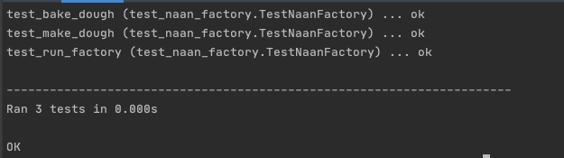

# Task - TDD Bread Factory

#### Topics
*Git, GitHub, Functions, TDD, Separation of concerns, DRY*


### Summary

TDD bread factory is the latest bread brand in Py Land. It always produces the best bread because it has the best testing strategy!
What they do is before they make any new bread, they make a test to make sure the end output is correct. Then they adjust the recipe until it's just right!
You are going to do the same with bread! This is called Test Driven Development.

### Tasks
This exercise is going to bring together lots of concepts.
1. Follow  the user stories to create a bread factory.
   * As a user, I can use the make dough with 'water' and 'flour' to make 'dough'. 
   * As a user, I can use the bake dough with dough to get naan.
   * As a user, I can user the run factory with water and flour and get naan.
   
2. Apply TDD - Test Driven development
    * Write the test.
    * Run it, and read the error. 
    * code and make it pass the test.  
    * This helps with:
      - Over engineering
      - Maintainable code
      - Reduce technical debt
      - Goes well with agile and working code
      - Errors can be your guide in complex systems

3. Run the code using the following commands
```python
import naanfactory
run factory()
```

### Acceptance Criteria
* You have written tests
* Tests pass
* You have written more test to make sure everything works as indented
* All user stories are satisfied
* Code does not break
* Code has exit condition
* DOD if followed

# Guide
1. Create a new project in PyCharm and a new repository on GitHub.
2. Within the project, create a [.gitignore](.gitignore) file to ignore irrelevant files.
    ```
    venv/
    /.idea/
    ```
3. Create a test file and code file. Ensure good naming convention has been adhered to. That is, the test file name begins with <test_>, and the names is logical. 
4. Install the pytest module
    ```
    pip install pytest
    ```
5. Within the test file, import relevant libraries:
    ```python
    from naan_factory import NaanFactory
    import unittest
    import pytest
    ```
6. Create a test class which will be a child class of ```unittest.TestCase```
7. Within this test class, instantiate the NaanFactory class which will be defined shortly in the code file. 
    ```python
    class TestNaanFactory(unittest.TestCase):
        naan_factory=NaanFactory()
    ```
8. Define the test functions:
    ```python
        # define the function for test make_dough
        def test_make_dough(self):
            # If the ingredients are "water" and "flour", returns "dough" therefore passes
            self.assertEqual(self.naan_factory.make_dough("water","flour"),"dough")
            # Check the else statement works. If the ingredients are anything other than flour and water, should return "not dough", therefore passing. 
            self.assertEqual(self.naan_factory.make_dough("flower","water"),"not dough")
    
        # Define the function to test bake_dough
        def test_bake_dough(self):
            self.assertEqual(self.naan_factory.bake_dough("dough"),"baked naan")
    
        # Define the function to test run_factory
        def test_run_factory(self):
            self.assertEqual(self.naan_factory.run_factory("water","flour"),"naan factory running")
    ```
9. Navigate to the code file.
10. Create a class, ensuring the name is the same as the one which has been instantiated in the test file. 
    ```python
    class NaanFactory:
    ```
11. Within the class, define functions. Use the user stories as a guide.
    ```python
        # 1: As a user, I can use the make dough with 'water' and 'flour' to make 'dough'.
        def make_dough(self,ingredient1,ingredient2):
            # If the ingredients are water and flour, returns dough.
            if ingredient1=="water" and ingredient2=="flour":
                return "dough"
            else:
                return "not dough"
    
        # 2: As a user, I can use the bake dough with dough to get naan.
        def bake_dough(self,dough):
            # If dough, return baked naan
            if dough=="dough":
                return "baked naan"
            else:
                return "baked something"
    
        # 3: As a user, I can user the run factory with water and flour and get naan.
        def run_factory(self,ingredient3,ingredient4):
            # If the ingredients are water and flour, returns naan factory running.
            if ingredient3=="water" and ingredient4=="flour":
                return "naan factory running"
            else:
                return "not running"
    ```
12. Run the tests with the following command: ```python -m pytest```
    * If more detail is needed, the following command can be run to view a test breakdown:
   ```python -m unittest discover -v```
    * Running this command delivers the following output:
    